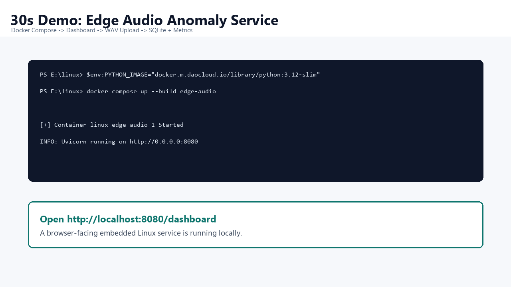
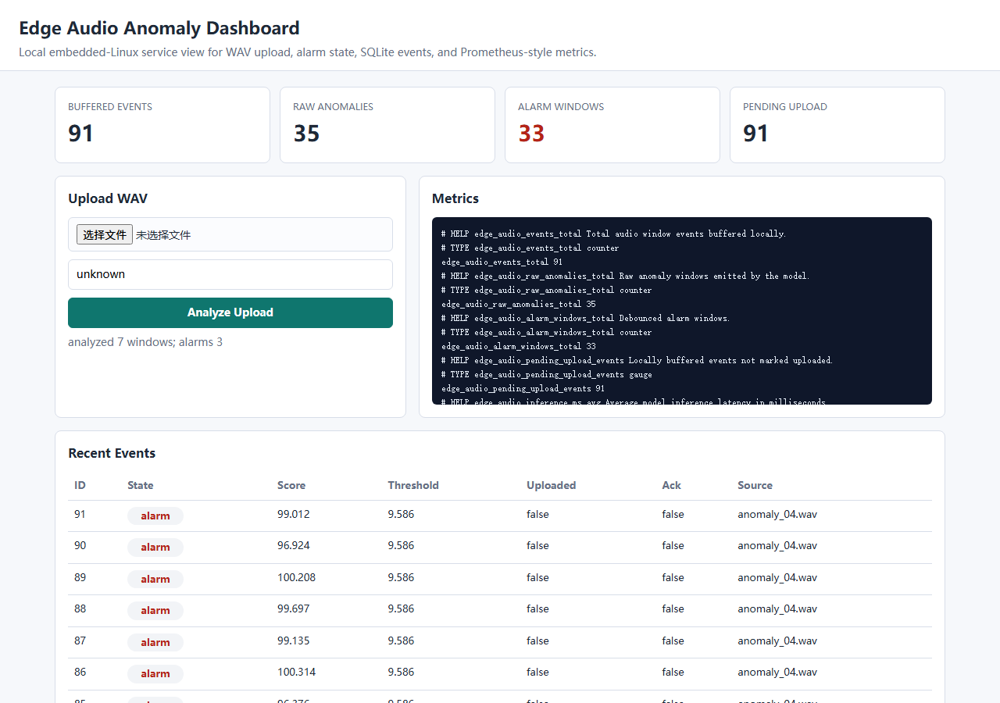
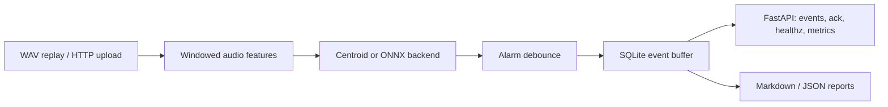

# Edge AI + Embedded Portfolio

[](https://github.com/chengzi030109/edge-ai-embedded-portfolio/actions/workflows/ci.yml)
[](https://github.com/chengzi030109/edge-ai-embedded-portfolio/actions/workflows/tinyml-predictive-maintenance.yml)

Hardware-free edge AI + embedded portfolio for internship applications: TinyML
predictive maintenance, Dockerized embedded-Linux audio anomaly service, edge
gateway, visual inspection, SQLite buffering, FastAPI/systemd deployment, and
CI-backed demos.



## Projects

| Project | What It Shows | Keywords | Run |
|---|---|---|---|
| [Edge Audio Anomaly Service](edge-audio-anomaly-service/) | Industrial audio anomaly service with dashboard, upload, metrics, SQLite, Docker, and systemd. | Embedded Linux, FastAPI, SQLite, ONNX-ready, Docker | `docker compose up --build edge-audio` |
| [TinyML Predictive Maintenance](tinyml-predictive-maintenance/) | MCU/TinyML-style vibration anomaly pipeline with fixed-point analysis and C inference path. | TinyML, fixed-point, C, ONNX/INT8, PHM2008 | `python scripts/run_portfolio_demo.py --quick` |
| [Edge AI Maintenance Gateway](edge-ai-maintenance-gateway/) | Telemetry ingest gateway with local persistence and API/dashboard shape. | Gateway, JSONL replay, HTTP ingest, SQLite | `python scripts/run_gateway_demo.py` |
| [Edge Vision Inspection](edge-vision-inspection/) | Synthetic defect inspection and annotated report generation. | Vision inspection, batch replay, reports | `python scripts/run_vision_demo.py` |
| [EdgeBench](edgebench/) | Small utility for measuring edge model latency and footprint. | Benchmark, latency, footprint | `python -m edgebench run --help` |

## One-Command Demo

```powershell
cd E:\linux
docker compose up --build edge-audio
```

Domestic network fallback:

```powershell
cd E:\linux
$env:PYTHON_IMAGE="docker.m.daocloud.io/library/python:3.12-slim"
docker compose up --build edge-audio
```

Open:

```text
http://localhost:8080/dashboard
http://localhost:8080/docs
http://localhost:8080/healthz
http://localhost:8080/metrics
```

Demo move: upload `edge-audio-anomaly-service/data/wav/anomaly/anomaly_01.wav`
from the dashboard and watch alarm counts, recent events, and metrics update.

## Copy/Paste For Applications

- [Submission package](docs/submission-package.md)
- [Resume-ready short version](docs/resume-short.md)
- [3-minute demo script](docs/demo-script-3min.md)
- [Interview Q&A](docs/interview-qna.md)
- [Demo troubleshooting](docs/demo-troubleshooting.md)

## Monorepo Shape

```text
E:\linux
├── tinyml-predictive-maintenance/     # MCU/TinyML anchor
├── edge-audio-anomaly-service/        # strongest embedded Linux service demo
├── edge-ai-maintenance-gateway/       # telemetry gateway and local persistence
├── edge-vision-inspection/            # visual inspection demo
├── edgebench/                         # benchmark utility
├── docs/                              # resume, demo, roadmap, interview notes
└── .github/workflows/                 # portfolio CI and TinyML CI
```

## Edge Audio Details

The audio service demonstrates the full embedded Linux application-layer path:

- Synthetic WAV and MIMII/ToyADMOS-style folder evaluation.
- Sliding-window audio features: RMS, ZCR, spectral centroid, flatness, band energy.
- Centroid anomaly detector with optional ONNX Runtime backend.
- Raw anomaly output separated from debounced equipment alarm state.
- SQLite event buffer with `uploaded` and `ack` fields for offline operation.
- FastAPI contracts for upload, event query, health check, metrics, and ack.
- Docker Compose demo, systemd service file, and logrotate example.





Key reports:

- [Audio anomaly report](edge-audio-anomaly-service/reports/audio_anomaly_report.md)
- [Model deployment report](edge-audio-anomaly-service/reports/model_deployment_report.md)
- [Public audio evaluation report](edge-audio-anomaly-service/reports/public_audio_evaluation.md)

## Local Verification

```powershell
cd E:\linux
$env:PYTEST_DISABLE_PLUGIN_AUTOLOAD='1'
.\tinyml-predictive-maintenance\.venv\Scripts\python.exe -m pytest -q edge-audio-anomaly-service
```

Full smoke test:

```powershell
cd E:\linux
.\smoke-test.ps1 -Python "E:\linux\tinyml-predictive-maintenance\.venv\Scripts\python.exe"
```
