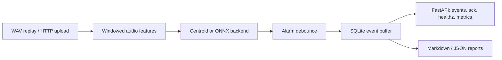
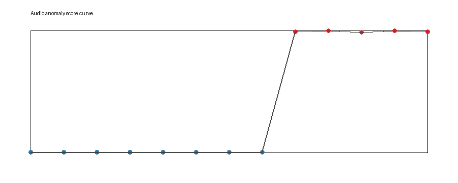
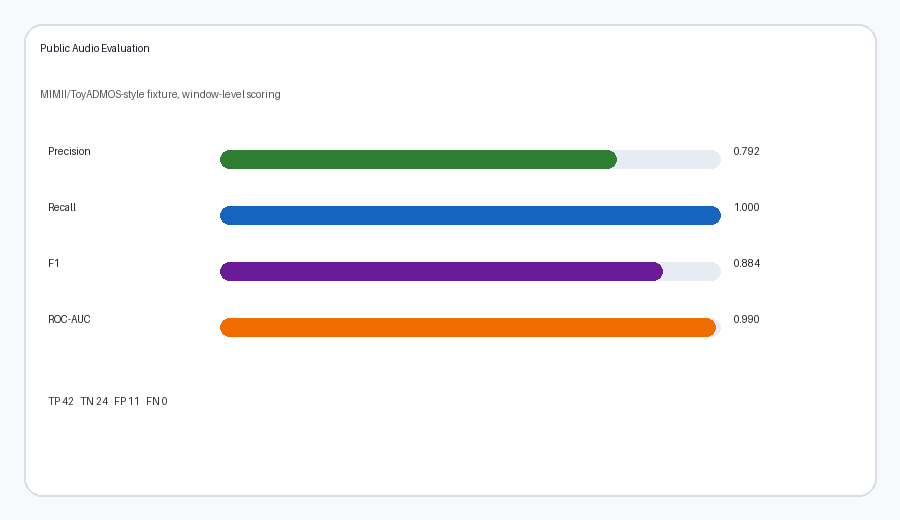
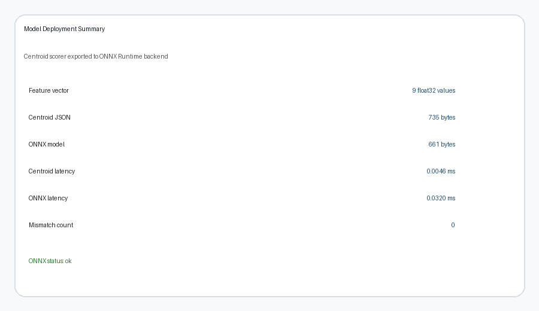

# Edge AI + Embedded Portfolio

[](https://github.com/chengzi030109/edge-ai-embedded-portfolio/actions/workflows/ci.yml)
[](https://github.com/chengzi030109/edge-ai-embedded-portfolio/actions/workflows/tinyml-predictive-maintenance.yml)

Hardware-free edge AI + embedded portfolio for internship applications. This is
a single monorepo, not a set of unrelated demos: each subproject covers one
piece of the embedded AI stack, from MCU/TinyML sensing to embedded Linux
services, local buffering, ONNX-style deployment, FastAPI contracts, systemd
deployment, CI, and reproducible reports.

## Monorepo Shape

```text
E:\linux
├── tinyml-predictive-maintenance/     # MCU/TinyML anchor
├── edge-audio-anomaly-service/        # strongest embedded Linux service demo
├── edge-ai-maintenance-gateway/       # telemetry gateway and local persistence
├── edge-vision-inspection/            # visual inspection demo
├── edgebench/                         # small benchmark utility
├── docs/                              # resume, demo, roadmap, interview notes
└── .github/workflows/                 # portfolio CI and TinyML CI
```

## Project Overview

| Project | Problem | Embedded / AI Keywords | Demo Command | Status |
|---|---|---|---|---|
| [TinyML Predictive Maintenance](tinyml-predictive-maintenance/) | Detect vibration degradation from simulated sensor windows and export MCU-ready parameters. | TinyML, Q-format simulation, C inference, ONNX/INT8, PHM2008, telemetry | `python scripts/run_portfolio_demo.py --quick` | Portfolio-ready |
| [Edge Audio Anomaly Service](edge-audio-anomaly-service/) | Detect abnormal industrial machine sound as a Linux edge service. | WAV replay, spectral features, ONNX Runtime backend, SQLite, FastAPI, systemd, metrics | `python scripts/run_audio_demo.py` | Portfolio-ready |
| [Edge AI Maintenance Gateway](edge-ai-maintenance-gateway/) | Ingest TinyML telemetry, store events locally, and expose gateway APIs/dashboard data. | JSONL replay, HTTP ingest contract, SQLite, dashboard, Linux gateway | `python scripts/run_gateway_demo.py` | Demo-ready |
| [Edge Vision Inspection](edge-vision-inspection/) | Detect synthetic visual defects and produce annotated inspection reports. | Image features, batch replay, annotated outputs, edge inspection | `python scripts/run_vision_demo.py` | Demo-ready |
| [EdgeBench](edgebench/) | Measure latency and footprint for edge AI model artifacts. | Benchmark CLI, latency, throughput, report generation | `python -m edgebench run --model ../tinyml-predictive-maintenance/artifacts/model.json --input-size 10` | Utility |

## Highlight: Edge Audio Anomaly Service

This is currently the strongest embedded Linux application-layer project in the
repo. It demonstrates the complete path from replay input to deployable service:

- Synthetic WAV and MIMII/ToyADMOS-style folder evaluation.
- Nine lightweight audio features for low-resource edge inference.
- Centroid anomaly detector with optional ONNX Runtime backend.
- Raw anomaly output separated from debounced equipment alarm state.
- SQLite event buffer with `uploaded` and `ack` fields for offline operation.
- FastAPI contracts for upload, event query, health check, metrics, and ack.
- systemd service file and logrotate example.





| Public Audio Evaluation | Model Deployment |
|---|---|
|  |  |

Key reports:

- [Audio anomaly report](edge-audio-anomaly-service/reports/audio_anomaly_report.md)
- [Model deployment report](edge-audio-anomaly-service/reports/model_deployment_report.md)
- [Public audio evaluation report](edge-audio-anomaly-service/reports/public_audio_evaluation.md)

API surface:

```text
POST /api/v1/audio/analyze
POST /api/v1/audio/analyze-windowed
POST /api/v1/audio/upload
POST /api/v1/audio/events/ack
GET  /api/v1/audio/events
GET  /api/v1/audio/summary
GET  /healthz
GET  /metrics
```

## Quick Start

Use the shared Python environment you already created for the TinyML project:

```powershell
cd E:\linux
$env:PYTEST_DISABLE_PLUGIN_AUTOLOAD='1'
.\tinyml-predictive-maintenance\.venv\Scripts\python.exe -m pytest -q edge-audio-anomaly-service
```

Run the main demos:

```powershell
cd E:\linux\edge-audio-anomaly-service
..\tinyml-predictive-maintenance\.venv\Scripts\python.exe scripts\run_audio_demo.py
..\tinyml-predictive-maintenance\.venv\Scripts\python.exe scripts\evaluate_public_audio_dataset.py
..\tinyml-predictive-maintenance\.venv\Scripts\python.exe scripts\benchmark_model_backends.py
```

Full local smoke test:

```powershell
cd E:\linux
.\smoke-test.ps1 -Python "E:\linux\tinyml-predictive-maintenance\.venv\Scripts\python.exe"
```

## Interview Pitch

Use this repo as a compact story:

> I built a hardware-free AI + embedded portfolio. One project simulates a
> TinyML predictive-maintenance node with MCU-oriented deployment artifacts.
> The Linux-side projects turn model outputs into services: telemetry gateway,
> industrial audio anomaly service, visual inspection, SQLite buffering, API
> contracts, reports, and systemd deployment.

Best project to lead with:

> Edge Audio Anomaly Service: a Linux edge service that replays or uploads WAV
> audio, extracts low-cost spectral features, runs a small anomaly model or ONNX
> backend, debounces alarms, stores events in SQLite for offline operation, and
> exposes health/metrics/API endpoints.

More detail:

- [Portfolio roadmap](docs/portfolio-roadmap.md)
- [Interview cheatsheet](docs/interview-cheatsheet.md)
- [Resume project writeups](docs/resume-projects.md)
- [Resume-ready short version](docs/resume-short.md)
- [Demo script](docs/demo-script.md)
- [3-minute demo script](docs/demo-script-3min.md)

## Showcase Figures

The small summary figures in `edge-audio-anomaly-service/reports/figures/` are
generated from report JSON files:

```powershell
cd E:\linux\edge-audio-anomaly-service
..\tinyml-predictive-maintenance\.venv\Scripts\python.exe scripts\generate_showcase_figures.py
```
