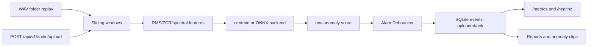

# Edge Audio Anomaly Service

Embedded Linux audio anomaly detection service for industrial machine sounds.
It runs without hardware by generating synthetic WAV files, then processes them
as sliding stream windows.

## What This Demonstrates

- Synthetic industrial WAV generation for hardware-free development.
- Public-dataset adapter for MIMII/ToyADMOS-style industrial audio folders.
- Sliding-window audio stream analysis, matching how ALSA/UDP input would be
  handled on an embedded Linux board.
- Nine lightweight features: RMS, peak, crest factor, zero-crossing rate,
  spectral centroid, spectral flatness, and low/mid/high band energy.
- One-class centroid anomaly detection trained on normal windows.
- Pluggable inference backend: default centroid now, optional ONNX Runtime later.
- Alarm debounce that separates raw model spikes from stable device alarms.
- SQLite edge buffering, anomaly clip extraction, Markdown/PNG/JSON reports,
  API route contract, browser dashboard, Docker Compose, and systemd deployment
  shape.

## Quick Start

```powershell
cd E:\linux\edge-audio-anomaly-service
..\tinyml-predictive-maintenance\.venv\Scripts\python.exe scripts\run_audio_demo.py
..\tinyml-predictive-maintenance\.venv\Scripts\python.exe scripts\query_audio_events.py --limit 5
..\tinyml-predictive-maintenance\.venv\Scripts\python.exe scripts\evaluate_public_audio_dataset.py
..\tinyml-predictive-maintenance\.venv\Scripts\python.exe scripts\benchmark_model_backends.py
..\tinyml-predictive-maintenance\.venv\Scripts\python.exe scripts\api_smoke_test.py
$env:PYTEST_DISABLE_PLUGIN_AUTOLOAD='1'
..\tinyml-predictive-maintenance\.venv\Scripts\python.exe -m pytest -q
```

Dashboard through Docker Compose from the repository root:

```powershell
cd E:\linux
docker compose up --build edge-audio
```

Open:

```text
http://localhost:8080/dashboard
http://localhost:8080/docs
http://localhost:8080/healthz
http://localhost:8080/metrics
```

Outputs:

- `data/wav/`
- `artifacts/audio_model.json`
- `data/audio_events.db`
- `reports/audio_anomaly_report.md`
- `reports/audio_score_curve.png`
- `reports/audio_events.json`
- `reports/model_deployment_report.md`
- `reports/model_deployment_report.json`
- `reports/public_audio_evaluation.md`
- `reports/public_audio_evaluation.json`
- `reports/anomaly_clips/`
- `scripts/query_audio_events.py` can inspect the SQLite event buffer after the
  demo run.

Typical demo output:

```text
windows analyzed: 91
raw anomaly windows: 35
alarm windows: 33
```

## Demo Result

The demo writes `reports/audio_anomaly_report.md` and
`reports/audio_score_curve.png`.




| Public Audio Evaluation | Model Deployment |
|---|---|
|  |  |

Regenerate the summary figures from report JSON:

```powershell
..\tinyml-predictive-maintenance\.venv\Scripts\python.exe scripts\generate_showcase_figures.py
```

## API Contract

- `POST /api/v1/audio/analyze`
- `POST /api/v1/audio/analyze-windowed`
- `POST /api/v1/audio/upload`
- `POST /api/v1/audio/events/ack`
- `GET /api/v1/audio/events`
- `GET /api/v1/audio/summary`
- `GET /`
- `GET /dashboard`
- `GET /healthz`
- `GET /metrics`

FastAPI is optional for the first local demo. When installed, the API persists
events to SQLite, so HTTP analysis behaves like a small edge service instead of
only returning transient in-memory responses.

Example service command:

```powershell
..\tinyml-predictive-maintenance\.venv\Scripts\python.exe -m uvicorn edge_audio.api:create_app --factory --host 127.0.0.1 --port 8080
```

The dashboard is intentionally served by the same FastAPI process. It uses
plain HTML and browser `fetch()` calls against `/api/v1/audio/summary`,
`/api/v1/audio/events`, `/api/v1/audio/upload`, and `/metrics`, so there is no
Node.js build step and no second process to deploy on an embedded Linux board.

API smoke test:

```powershell
..\tinyml-predictive-maintenance\.venv\Scripts\python.exe -m pip install -e .[api]
..\tinyml-predictive-maintenance\.venv\Scripts\python.exe scripts\api_smoke_test.py
```

The smoke test starts uvicorn, checks `/healthz`, uploads a WAV to
`/api/v1/audio/upload`, reads `/metrics`, and marks one event acknowledged via
`/api/v1/audio/events/ack`.

## Model Deployment Path

The default backend is `centroid`, so the project runs without heavyweight AI
runtime packages:

```powershell
..\tinyml-predictive-maintenance\.venv\Scripts\python.exe scripts\run_audio_demo.py --backend centroid
```

The optional ONNX path exports the same centroid score calculation to an ONNX
graph, then benchmarks Python centroid inference against ONNX Runtime:

```powershell
..\tinyml-predictive-maintenance\.venv\Scripts\python.exe -m pip install -e .[onnx]
..\tinyml-predictive-maintenance\.venv\Scripts\python.exe scripts\export_audio_onnx.py
..\tinyml-predictive-maintenance\.venv\Scripts\python.exe scripts\benchmark_model_backends.py
..\tinyml-predictive-maintenance\.venv\Scripts\python.exe scripts\run_audio_demo.py --backend onnx
```

If `onnx` or `onnxruntime` cannot be imported on the local machine, the default
centroid flow still works and the benchmark report records the ONNX skip reason.

## Real Dataset Path

The project can evaluate MIMII/ToyADMOS-style folder layouts without changing
the service code. The default command generates a small local fixture with a
similar directory shape; real metric claims should use downloaded public data.

```powershell
..\tinyml-predictive-maintenance\.venv\Scripts\python.exe scripts\evaluate_public_audio_dataset.py
..\tinyml-predictive-maintenance\.venv\Scripts\python.exe scripts\evaluate_public_audio_dataset.py --data-root E:\datasets\MIMII\fan
```

See `docs/real-datasets.md` for dataset links and folder conventions.

## Embedded Linux Notes

- WAV replay stands in for ALSA microphone capture or UDP audio packets.
- Sliding-window analysis mirrors a long-running worker service.
- Raw model decisions are debounced before they become device alarms, which is
  closer to industrial monitoring behavior.
- ONNX Runtime replaces only the inference backend; capture, feature extraction,
  alarm debounce, SQLite storage, and reports stay unchanged.
- SQLite stores window events locally when the network is unavailable.
- `uploaded` and `ack` fields simulate offline buffering and cloud
  acknowledgement.
- Anomaly clips are saved for later inspection or upload.
- `systemd/edge-audio-anomaly-service.service` shows the deployment shape.
- `docs/linux-deployment.md` explains the board-side input boundary, resource
  budget, service process split, and next upgrade path.
- `docs/real-datasets.md` explains MIMII/ToyADMOS-style data evaluation.
