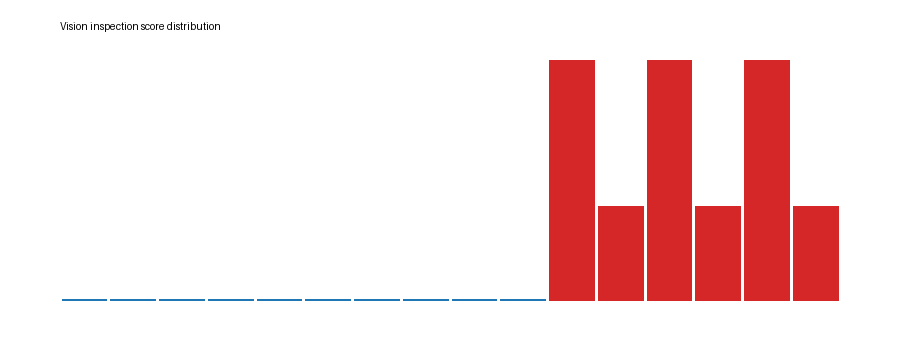

# Edge Vision Inspection Report

- Images analyzed: `16`
- Defects detected: `6`

| File | Label | Score | Threshold | Defect |
|---|---|---:|---:|---|
| normal_00.png | normal | 1.531 | 4.426 | False |
| normal_01.png | normal | 1.527 | 4.426 | False |
| normal_02.png | normal | 1.237 | 4.426 | False |
| normal_03.png | normal | 3.334 | 4.426 | False |
| normal_04.png | normal | 1.764 | 4.426 | False |
| normal_05.png | normal | 1.486 | 4.426 | False |
| normal_06.png | normal | 1.641 | 4.426 | False |
| normal_07.png | normal | 1.402 | 4.426 | False |
| normal_08.png | normal | 1.695 | 4.426 | False |
| normal_09.png | normal | 3.024 | 4.426 | False |
| defect_00.png | defect | 18079.020 | 4.426 | True |
| defect_01.png | defect | 7025.901 | 4.426 | True |
| defect_02.png | defect | 18079.020 | 4.426 | True |
| defect_03.png | defect | 7025.901 | 4.426 | True |
| defect_04.png | defect | 18079.020 | 4.426 | True |
| defect_05.png | defect | 7025.901 | 4.426 | True |

## Linux Application Notes

Folder replay stands in for USB camera or RTSP input. ONNX detectors can
replace the centroid model later while keeping the batch/report pipeline.
