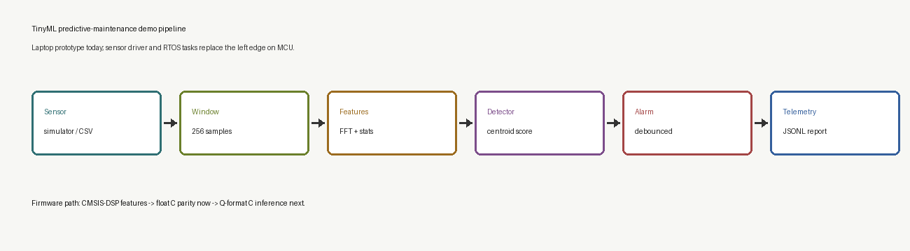
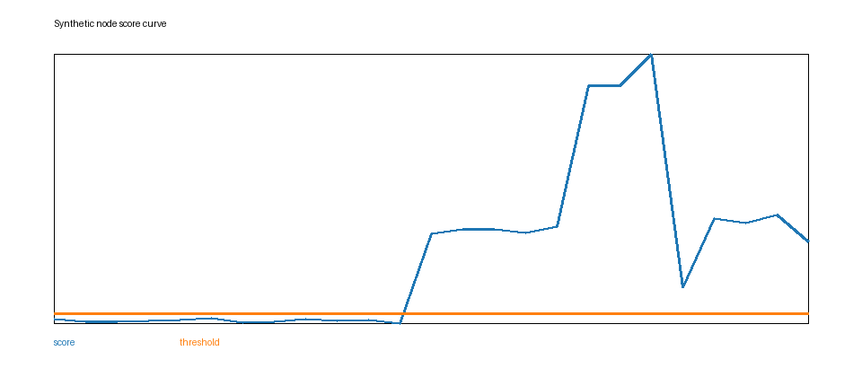
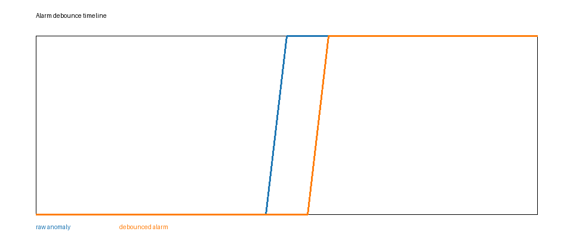
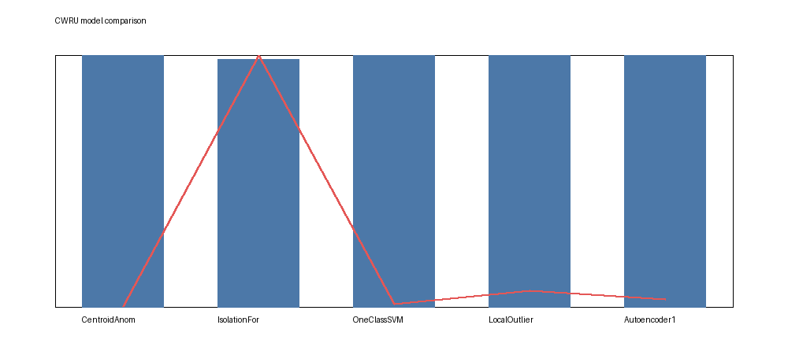
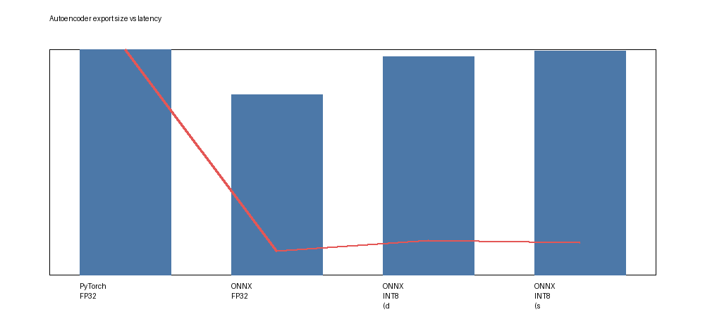
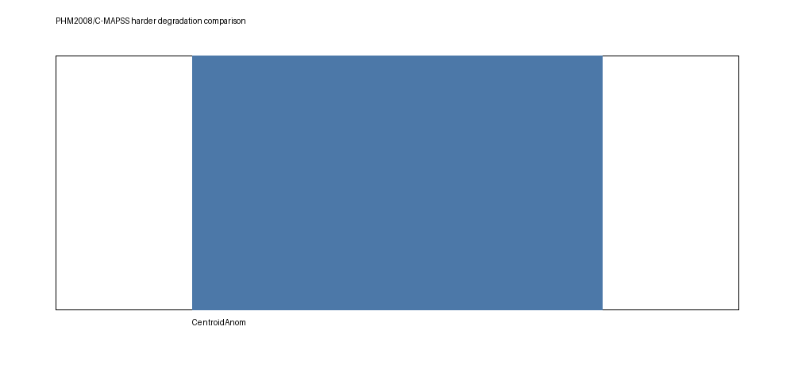

# TinyML Predictive Maintenance System

<!--
Once the repo is pushed to GitHub, replace OWNER with the actual GitHub user/org
name in the badge URL below. The workflow file is already in place at
.github/workflows/tinyml-predictive-maintenance.yml.
-->
[](https://github.com/OWNER/linux/actions/workflows/tinyml-predictive-maintenance.yml)

Hardware-free AI + embedded predictive-maintenance project. It simulates an
MCU/RTOS vibration-monitoring node on a laptop today, while keeping the model,
feature, alarm, telemetry, and C inference boundaries ready for MCU migration.

```text
synthetic signal or CSV replay
-> fixed-size windows
-> FFT/statistical features
-> tiny anomaly detector
-> alarm debounce
-> JSONL telemetry
-> reports, figures, and MCU migration notes
```

## Portfolio Result Summary

Start here if you only have a few minutes:

- Full demo index: [`reports/portfolio_summary.md`](reports/portfolio_summary.md)
- MCU migration story: [`docs/mcu-migration.md`](docs/mcu-migration.md)
- Interview notes: [`docs/interview-notes.md`](docs/interview-notes.md)
- Resume bullets: [`docs/resume-bullets.md`](docs/resume-bullets.md)
- Synthetic evaluation: [`reports/evaluation.md`](reports/evaluation.md)
- Fixed-point drift: [`reports/fixed_point_report.md`](reports/fixed_point_report.md)
- MCU resource budget: [`reports/mcu_resource_budget.md`](reports/mcu_resource_budget.md)
- PHM2008/C-MAPSS harder sample: [`reports/phm2008_comparison.md`](reports/phm2008_comparison.md)

Current generated snapshot:

| Area | Result | Why It Matters |
|---|---:|---|
| Synthetic detector | F1 0.9831, accuracy 0.9750 | End-to-end signal -> feature -> anomaly pipeline works |
| CWRU bearing data | F1 1.0000 for centroid | Useful sanity check, but close to a known ceiling |
| PHM2008/C-MAPSS sample | F1 0.9600, FPR 0.2727 | Harder gradual degradation story than CWRU |
| Fixed-point simulation | 0 decision mismatches | Q-format path looks feasible before MCU port |
| C inference | Float + Q24.8 parity tests | Firmware-facing centroid paths are covered |



## Run In 10 Minutes

```powershell
cd E:\linux\tinyml-predictive-maintenance
.\setup.ps1

# One command for the presentation-oriented demo. It does not need external data.
.\.venv\Scripts\python.exe scripts\run_portfolio_demo.py --quick
```

The demo trains a synthetic model, runs synthetic telemetry, replays CSV sensor
samples, evaluates metrics, refreshes the fixed-point report, prepares the
PHM2008-shape sample, generates figures, and writes:

```text
reports/portfolio_summary.md
```

Useful individual commands:

```powershell
.\.venv\Scripts\python.exe scripts\train_model.py
.\.venv\Scripts\python.exe scripts\run_simulated_node.py --duration 4
.\.venv\Scripts\python.exe scripts\run_simulated_node.py --source csv --input data\examples\vibration_demo.csv
.\.venv\Scripts\python.exe scripts\evaluate_model.py --windows-per-state 40
.\.venv\Scripts\python.exe scripts\fixed_point_report.py
.\.venv\Scripts\python.exe scripts\mcu_resource_report.py
.\.venv\Scripts\python.exe scripts\generate_figures.py
```

Optional dashboard:

```powershell
.\.venv\Scripts\streamlit.exe run gateway\app.py
```

## Project Highlights

- RTOS-style staged pipeline: sensor/replay, feature extraction, inference,
  alarm debounce, telemetry.
- Generic CSV replay with minimum schema `signal`; optional `timestamp` and
  `label` columns.
- Telemetry keeps both raw model decisions and debounced alarm state:
  `is_anomaly_raw`, `is_alarm`, and `alarm_state`.
- Tiny centroid detector for embedded deployment, plus sklearn/PyTorch/ONNX
  comparison paths for algorithm discussion.
- Float C inference and Q24.8 integer C inference with parity tests.
- MCU resource-budget report for model bytes, buffer bytes, telemetry estimate,
  and per-window inference work.
- Static portfolio figures generated from reports, with Pillow fallback when
  matplotlib is not available.

Generated figures:











## CSV Replay And Alarm Debounce

The replay loader supports exported sensor data in this minimum format:

```csv
timestamp,signal,label
0.0000,0.012,normal
0.0006,0.018,normal
```

Only `signal` is required. If `label` is missing, telemetry uses
`true_state="unknown"`.

```powershell
.\.venv\Scripts\python.exe scripts\run_simulated_node.py `
  --source csv `
  --input data\examples\vibration_demo.csv `
  --telemetry runs\csv_telemetry.jsonl
```

Default debounce policy:

- 3 consecutive anomaly windows enter alarm.
- 5 consecutive normal windows recover from alarm.

```powershell
.\.venv\Scripts\python.exe scripts\run_simulated_node.py --alarm-on-count 3 --alarm-off-count 5
```

## Real-World And Harder Dataset Checks

CWRU bearing data is the classic condition-monitoring benchmark. This project
uses it as a real-data sanity check, but the README is intentionally cautious:
CWRU seeded faults often separate very cleanly, so F1 near 1.0 should not be
oversold as proof of industrial robustness.

```powershell
.\.venv\Scripts\python.exe scripts\prepare_cwru.py manifest
.\.venv\Scripts\python.exe scripts\prepare_cwru.py synthetic
.\.venv\Scripts\python.exe scripts\compare_models.py
```

PHM 2008 / NASA C-MAPSS is an aircraft-engine degradation dataset, not a
bearing vibration dataset. The project frames it as anomaly/degradation
detection rather than full RUL prediction, keeping the scope appropriate for an
internship portfolio.

Official references:

- [data.gov PHM 2008 Challenge](https://catalog.data.gov/dataset/phm-2008-challenge-d1f2b)
- [NASA DASHlink C-MAPSS](https://c3.ndc.nasa.gov/dashlink/resources/139/)

Offline reproducible sample:

```powershell
.\.venv\Scripts\python.exe scripts\prepare_phm2008.py synthetic --out data\phm2008_sample\train_FD001.txt --units 12 --cycles 180 --sensors 6 --seed 2027
.\.venv\Scripts\python.exe scripts\compare_phm2008.py --data-root data\phm2008_sample
```

## Quantization And TinyML Notes

There are two separate deployment stories:

- `scripts/quantization_report.py` compares PyTorch FP32, ONNX FP32, and ONNX
  INT8 autoencoder exports. This is the heavier learned-model path.
- `scripts/fixed_point_report.py` simulates Q24.8 centroid parameters and the
  integer input path, then reports score drift and anomaly-decision mismatches.
  This is the lightweight MCU path.
- `scripts/mcu_resource_report.py` estimates sample buffers, feature buffers,
  model bytes, telemetry payload size, and per-window inference work.

Current firmware status:

- Implemented: float centroid inference in `firmware/inference.c`.
- Implemented: Q24.8 integer centroid inference in `firmware/inference_fixed.c`.
- Tested: Python/C parity through `tests/test_c_inference_parity.py`.
- Tested: Python/C fixed-point parity through `tests/test_c_fixed_inference_parity.py`.
- Next: direct Q-format feature extraction and CMSIS-DSP FFT feature extraction.

See [`docs/mcu-migration.md`](docs/mcu-migration.md) for the RTOS task split
and firmware roadmap.

## Project Layout

```text
configs/
  default.json              reproducible project settings
src/tpm/
  config.py                 typed config loader
  signal_sim.py             synthetic motor vibration generator
  features.py               MCU-friendly feature extraction
  model.py                  tiny centroid anomaly detector
  baselines.py              sklearn baselines with a shared predict() contract
  autoencoder.py            1D autoencoder with optional ONNX INT8 export
  alarm.py                  raw anomaly -> debounced alarm state
  fixed_point.py            Q24.8 centroid parameter simulation
  portfolio.py              portfolio summary rendering
  rtos_sim.py               synchronous RTOS-style node pipeline
  datasets/
    csv_replay.py           generic timestamp/signal/label CSV replay
    cwru.py                 CWRU bearing dataset loader
    phm2008.py              PHM08/C-MAPSS multivariate degradation loader
scripts/
  run_portfolio_demo.py     one-command portfolio demo
  train_model.py            train normal-only detector
  run_simulated_node.py     run sensor -> feature -> inference -> telemetry
  evaluate_model.py         generate JSON/Markdown evaluation reports
  generate_figures.py       static PNG plots for README/reports
  fixed_point_report.py     float centroid vs Q-format simulation
  mcu_resource_report.py    MCU model/buffer/telemetry resource budget
  prepare_phm2008.py        manifest/synthetic PHM08/C-MAPSS sample generator
  compare_phm2008.py        centroid/baseline comparison on PHM08 windows
  compare_models.py         centroid vs baselines on CWRU features
gateway/
  app.py                    Streamlit gateway dashboard
firmware/
  feature_extract.c/.h      portable C feature prototype
  inference.c/.h            portable C centroid inference
  inference_fixed.c/.h      Q24.8 integer centroid inference
tests/
  test_*.py                 unit, replay, fixed-point, dataset, and parity tests
```

## Testing

On this Windows environment, disabling third-party pytest plugin autoload avoids
unrelated plugin imports from interfering with local unit tests:

```powershell
cd E:\linux\tinyml-predictive-maintenance
$env:PYTEST_DISABLE_PLUGIN_AUTOLOAD='1'
.\.venv\Scripts\python.exe -m pytest -q
```

Expected local result after the portfolio polish:

```text
23 passed, 2 skipped
```

Skipped tests are optional-stack checks for local Windows environments with
broken `torch`/`sklearn` imports due to system `asyncio/_overlapped` issues.
The C parity tests run locally when `E:\tools\tcc\tcc` or another C compiler is
on `PATH`.
